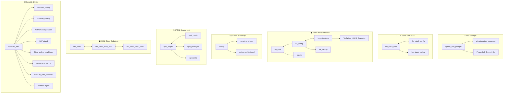

# 🗺️ Master Repository & Workspace Architecture Map

**Version:** 3.1.0  
**Target Systems:** Google Antigravity (IDE/CLI), Jules (`jules.google.com`), Claude Code, Gemini CLI, Hermes Agent, OpenJarvis  
**Root Directory:** `C:\GitHub\`

---

## 🎯 Global Directives for AI Agents (Antigravity & Jules)

1. **Strict 3-Tier Suffix Split Standard**:
   * `*_core` / `*_infra` / `*_packages`: **Public / Generic Code Only.** (No hardcoded IPs, passwords, hostnames, VMIDs, or customer secrets).
   * `*_config`: **Private Configurations.** (Specific IPs, secrets, node overrides, GitOps live state).
   * `*_backup`: **Configuration Snapshots.** (YAML, `.storage/`, automations, blueprints; DB/blobs strictly excluded).
2. **Public vs. Police/Enterprise Partitioning**:
   * [`scripts-and-tools`](file:///C:/GitHub/scripts-and-tools): Universal, open-source-safe system administration scripts.
   * [`scripts-and-tools-pol`](file:///C:/GitHub/scripts-and-tools-pol): Police- & enterprise-specific tools (L-Kennung, FINDUS, IGVP, MultiRDP).
3. **Single Source of Truth for Directives**:
   * Master agent rules are maintained solely in [`agents_and_prompts/AGENTS.md`](file:///C:/GitHub/agents_and_prompts/AGENTS.md) and [`C:\GitHub\AGENTS.md`](file:///C:/GitHub/AGENTS.md).
   * The synchronization engine (`Sync-GitHubRepos.ps1`) automatically replicates these directives to all repositories during sync runs.

---

## 🌐 Domain Breakdown & Repository Matrix

---

## 📚 Domain Workspaces & Repository Scope

### 1. 🤖 AI, Agents & Prompts
* **Workspace:** [`ai-prompts.code-workspace`](file:///C:/GitHub/ai-prompts.code-workspace)
* **Repositories:**
  * [`agents_and_prompts`](file:///C:/GitHub/agents_and_prompts): **Single Source of Truth** for system-wide standards, prompt templates, and execution directives.
  * [`ai_automation_suggester`](file:///C:/GitHub/ai_automation_suggester): Heuristic & AI recommendations for workflow automations.
  * [`Powershell_Gemini_CLI`](file:///C:/GitHub/Powershell_Gemini_CLI): PowerShell terminal integration for Gemini API.

### 2. 🧠 Local LLM Stack (LXC 600)
* **Workspace:** [`llm-stack.code-workspace`](file:///C:/GitHub/llm-stack.code-workspace)
* **Repositories:**
  * [`llm_stack_core`](file:///C:/GitHub/llm_stack_core): Reasonix, Coral TPU passthrough, local LLM server runtime, Hermes plugin.
  * [`llm_stack_config`](file:///C:/GitHub/llm_stack_config): Host overrides, API keys, private node endpoints (`aragdun`).
  * [`llm_stack_backup`](file:///C:/GitHub/llm_stack_backup): Archived dumps & model metadata mirrors.
  * *Archive:* `ARCHIVE/LLM_Stack_archive`

### 3. 🏠 Home Assistant Ecosystem
* **Workspace:** [`ha-stack.code-workspace`](file:///C:/GitHub/ha-stack.code-workspace)
* **Repositories:**
  * [`ha_core`](file:///C:/GitHub/ha_core): Container/Docker templates, core dependencies, base OS bootstrap.
  * [`ha_config`](file:///C:/GitHub/ha_config): Live YAML automations, Lovelace dashboards, GitOps live state.
  * [`ha_extensions`](file:///C:/GitHub/ha_extensions): Custom HACS integrations, blueprints, pyscripts, add-ons.
  * [`ha_backup`](file:///C:/GitHub/ha_backup): Config-only backup repository (YAML, `.storage/`, blueprints, addon configs; DB/blobs strictly excluded).
  * [`hassio`](file:///C:/GitHub/hassio): Legacy Supervisor addons & helper definitions.
  * [`TariffWise_HACS_Extension`](file:///C:/GitHub/TariffWise_HACS_Extension): Dynamic electricity tariff calculation integration.
  * *Archives:* `ARCHIVE/ha_backup_full_archive`, `ARCHIVE/HomeAssistant-config-_archive`

### 4. 🏢 SysAdmin & DevOps Automation
* **Workspace:** [`scripts-and-tools.code-workspace`](file:///C:/GitHub/scripts-and-tools.code-workspace)
* **Repositories:**
  * [`configs`](file:///C:/GitHub/configs): Master repository for cross-machine sync (`Sync-GitHubRepos.ps1`), editor settings, and environment secrets.
  * [`scripts-and-tools`](file:///C:/GitHub/scripts-and-tools): Public, generic PowerShell & Bash sysadmin scripts.
  * [`scripts-and-tools-pol`](file:///C:/GitHub/scripts-and-tools-pol): Police- & enterprise-specialized Active Directory management (L-Kennung, FINDUS, IGVP).
  * *Archives:* `ARCHIVE/ADVisualizer_archive`, `ARCHIVE/rdpwrap_archive`

### 5. 🏫 OPSI Software Deployment
* **Workspace:** [`opsi-stack.code-workspace`](file:///C:/GitHub/opsi-stack.code-workspace)
* **Repositories:**
  * [`opsi_scripts`](file:///C:/GitHub/opsi_scripts): Windows 11 hardening, AppX debloat, school client packaging & general rollout scripts.
  * [`opsi_packages`](file:///C:/GitHub/opsi_packages): Built OPSI deployment packages (`.opsi`) and control definitions.
  * [`opsi_config`](file:///C:/GitHub/opsi_config): Server & client specific configurations for OPSI.
  * [`opsi_infra`](file:///C:/GitHub/opsi_infra): Server infrastructure bootstrap & network automation for OPSI.

### 6. 🖥️ VKS & Cisco Endpoints
* **Workspace:** [`vks.code-workspace`](file:///C:/GitHub/vks.code-workspace)
* **Repositories:**
  * [`vks_kiosk`](file:///C:/GitHub/vks_kiosk): Live Debian & WinPE Kiosk OS, browser lockdown, overlay filesystem.
  * [`vks_cisco_dx80_mod`](file:///C:/GitHub/vks_cisco_dx80_mod): Cisco DX80 lockbreak, custom Android launcher, hybrid web shortcuts.
  * [`vks_cisco_dx80_base`](file:///C:/GitHub/vks_cisco_dx80_base): Provisioning XML files, Telekom SIP dialers, clean baseline configs.

### 7. 🌐 Homelab, Telemetry & Infrastructure
* **Workspace:** [`homelab-stack.code-workspace`](file:///C:/GitHub/homelab-stack.code-workspace)
* **Repositories:**
  * [`homelab_infra`](file:///C:/GitHub/homelab_infra): Proxmox orchestration, Docker compose setups, Traefik routing playbooks.
  * [`homelab_config`](file:///C:/GitHub/homelab_config): Host node IPs, Wireguard keys, cluster overrides.
  * [`homelab_backup`](file:///C:/GitHub/homelab_backup): Disaster recovery archives, node configuration snapshots.
  * [`NetworkAnalyseStack`](file:///C:/GitHub/NetworkAnalyseStack): Wireshark, LLDP and packet capturing tools.
  * [`SAT-ebusd`](file:///C:/GitHub/SAT-ebusd): eBus IoT daemon and MQTT heating bridge.
  * [`Client_online_survilliance`](file:///C:/GitHub/Client_online_survilliance): Network device ping monitor and alerting service.
  * [`HDDSpaceChecker`](file:///C:/GitHub/HDDSpaceChecker): Storage utilization monitoring tool.
  * [`NewFile_auto_sendMail`](file:///C:/GitHub/NewFile_auto_sendMail): Folder watcher and automated SMTP notification dispatcher.
  * [`homelab-Agent`](file:///C:/GitHub/homelab-Agent): Automated maintenance agent routines for homelab.
